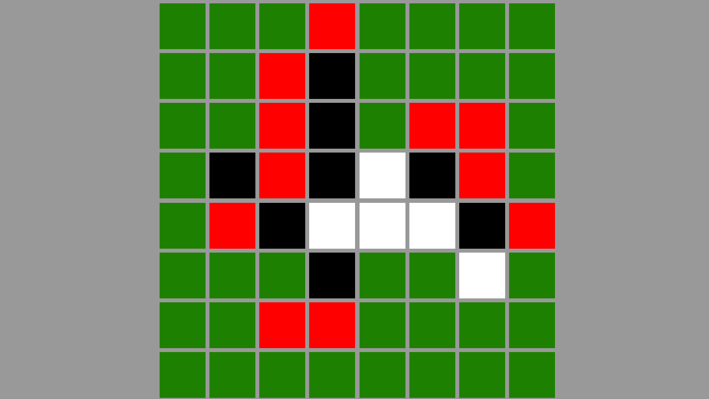

# Bevy Reversi Project

## Introduction

This is a small personal project to learn Rust and Bevy. I want to practice my understanding of Rust and try out an ECS framework. I was aware about ECS prior to working with Bevy. But this is the first ECS framework I get my hands on.

## What I’ve Learned

It's a data-driven architecture, means we manipulate the logic with data, if you want to chain logics together, the preferred way is to use components, resources, or events, not directly calling one system from another.

### Bevy’s Data Types

- Component - a data that will be attached to entity instance.
- Resource - a data that will be globally accessible to the world as a single instance per type.
- Event - a data that will be read/write in FIFO order via event handles in each schedule run.

### Determinism And Data Transparency

I believe that at least in theory, we can make a snapshot of these data along with the entities(which is just an id), serialize it as a save file, load it, then dump the entire de-serialized data into the world with the same sets of same systems, it should be able to resume the behavior almost perfectly. This is because the data is mostly transparent. Although Bevy does provide a way that a system can have its own exclusive data, it’s called Local<T>, which I’m not sure if it’s implemented based on the regular resource or not. 

### Encapsulation in ECS

From my understanding, for within this context, it’s about restricting datatype access, not letting other irrelevant systems know the type, therefore prevent them from querying the data instance. Which in my case, the systems of the game result screen has no means to access the data that gameplay systems are using.

### System Piping

It seems in contrast with data driven paradigm, Bevy also supports static system composition too. This means we can potentially create our own system adapter to combine multiple systems together. I don’t know if we should do this, but judging from adapters that Bevy has right now, they are mainly for debugging, by combining a system with returning result and a system created with a sole purpose of printing value from the piped data. This is quite interesting, it means maybe we can have a complex container type to log what’s going in and out of the target system, making the development process much easier.

## Challenges

In Bevy, I find working on each individual system quite easy, however that most difficult thing is to schedule them together in an appropriate order. Because we drive every by data, order which data is sent drastically affects the logic, sending wrong data at a wrong time can cause some systems to not run, because of their run condition. 

If I were to work on a new ECS project, then I’ll have to think properly on how the systems related to each other. For a hard state chain like a board game, maybe it’s better to use Rust enum to represent state flow and host the data in each state. This should make it clear on how state transitioning works, but become less flexible and prevent the system from running in parallel.

## What I’m Still Not Sure Of

- The separation of worlds. To totally separate the logics from each other and be efficient as possible. I think it maybe a good idea to have a world entirely for a complex system set. Doing this should reduce the amount of data and computation significantly. But then I will have to somehow handle sending data between worlds, which might not be the way that Bevy was designed. I’ll have to spend some time deep into the source code in order to understand this. My wild guess is that Bevy might have a run-time checking to optimize this, because it knows all the connections between data and systems.

- Bevy doesn’t treat data and component differently. This means who ever has access to the data type also can query components. But from my concern about encapsulation, I decided to create a clear layer between the two, which works fine. But it’s still cumbersome to have another level of dereferencing in order to get to the data. Maybe I’m too cautious about this, and it’s fine to use data as component as Bevy does.

- The internal system schedule and event schedule. I tried to send data between states by using event channel, and let the initialization system work at the start of the new state. This doesn’t seem to work, as the data didn’t arrive from the event channel, so the run condition wasn’t met, preventing initialization system from running. I moved the system to run in update schedule instead, and it seems to work. But I don’t understand the reason. Further move investigation is required.
